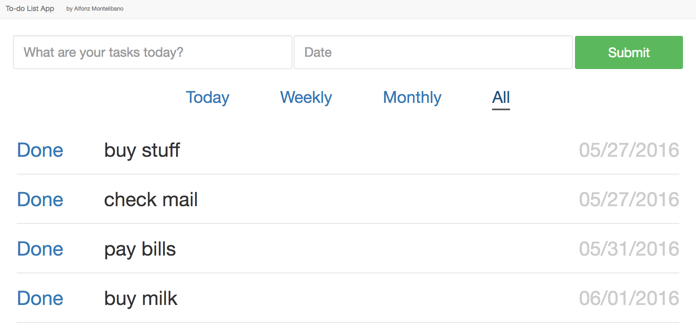

# Todo-List App
_A simple todo list app for Pepper._



## Instructions
### Adding a task
Type the task name on the input box and select the expiraton date using the date picker. (Supposedly this should have text-to-speech recognition as well so you can just talk to Pepper instead of typing)

### View tasks
There are several ways to get the tasks from the database:

1. You can filter the task list on the tablet view by Today, Weekly, Monthly or All.

2. Touch Pepper's left back hand and he will say all your tasks for Today.

   ```
   Robot: You have 2 tasks today. buy stuff , and check mail.
   ```

3. You can also ask Pepper 'What are my tasks' or 'Tell me my tasks'. For example:
   ```
   Human: What are my tasks? (100%)
   Robot: Do you want tasks today , this week , or this month ?
   Human: Today (100%)
   Robot: You have 2 tasks today. buy stuff , and check mail.
   Human: What are my tasks this month? (100%)
   Robot: You have 3 tasks this month. buy stuff , check mail , and pay bills.
   ```

### Mark tasks as Done
Click on 'Done' on the list to mark the task as done and delete it. 'Done' and 'Expired' tasks will no longer show up on the lists.
